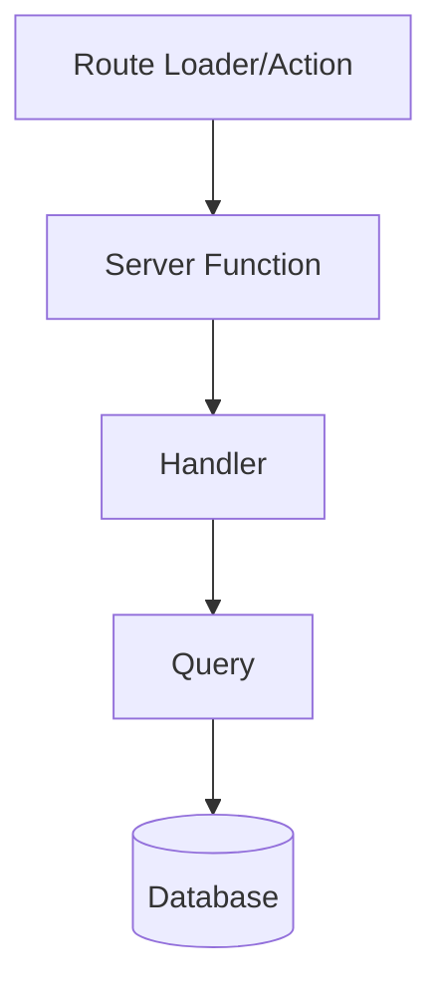

# ADR-002: Domain architecture

## Status

Accepted — 2025-02-14, last updated 2026-07-17. Living document: owns module
structure and naming for the whole app (ADR-007 defers to it).

## Context

File structure needs to stay low-cognitive-load, layered, and support TanStack Start's full-stack server function patterns.

## Decision

Domain-oriented feature modules (screaming architecture): code grouped by business domain, layered **by convention** inside each module. This is deliberately *not* tactical DDD — no aggregates, repositories, or ports — but the layer responsibilities map cleanly:

| Layer | Lives in | May import |
|---|---|---|
| Interface | `presentation/{concept}/`, `src/routes/`, `src/ui/` | application (server fns, hooks), models |
| Application | `api/{domain}.ts`, `api/handlers.ts`, `services/`, `validation/` | domain, infrastructure |
| Domain | `models/`, `utils/`, pure engines (reducers/functions) | other domain code only — never React, never Drizzle |
| Infrastructure | `api/queries.ts`, `src/database/` | models (DTO conversion) |

**The dependency rule**: imports point downward only (interface → application → domain), and infrastructure is reached only through the application layer. The domain layer stays framework-free so it is trivially unit-testable — ADR-007's "pure engine first" is this rule applied to session-run. Known concession vs. textbook DDD: handlers/services import concrete queries directly (no repository interfaces); acceptable until we ever need to swap infrastructure.

**Enforcement**: `npm run lint:arch` (dependency-cruiser, config in `.dependency-cruiser.cjs`) fails on violations. Type-only imports across layers are allowed — types are contracts, not coupling; the rules bite on runtime imports.

### Top-level structure

```
src/
├── components/   # Legacy
├── config/       # App configuration constants
├── database/     # Drizzle setup, schema, migrations, seeds
├── modules/      # Feature-oriented domain modules (DDD) — target name
├── domains/      # Legacy alias for modules/, being migrated over
├── hooks/        # Legacy
├── lib/          # Legacy
├── presentation/ # Presentation-mode feature (slides)
├── routes/       # TanStack Router file-based routes
├── styles/       # Global Tailwind CSS
├── test/         # Test setup, shared mocks
├── ui/           # Presentational primitives (no business logic)
└── utils/        # Legacy
```

> `domains/` → `modules/` is an in-progress rename. New domains go under `modules/`; existing ones under `domains/` migrate opportunistically, not as a big-bang rewrite.

### Domain structure

```
src/modules/{domain}/
├── api/
│   ├── {domain}.ts       # Server function — auth, validation, entry point
│   ├── handlers.ts       # Orchestration + error handling
│   ├── handlers.spec.ts
│   ├── queries.ts        # Drizzle queries
│   └── queries.spec.ts
├── presentation/         # Smart components + hooks, colocated per concept
│   └── {concept}/        #   e.g. gate/, shop/ — wiring only, zero HTML/CSS
├── data/                 # Static data, constants, fixtures
├── factories/            # Test/seed data factories
├── hooks/                # Domain-wide hooks shared across concepts
├── models/               # Domain types + DTO conversions
├── view/                 # Viewmodels — UI-shaped projections built from one or more models for a specific screen/component
├── services/             # Business logic reused across handlers or domains
├── utils/                # Domain helpers
└── validation/           # Zod schemas
```

Create only the subfolders a domain actually needs — this is a menu, not a mandatory scaffold.

> **Component placement (resolves ADR-007's open item, 2026-07-17):** smart components live in `presentation/{concept}/`, colocated with the hooks that only serve that concept. The older flat `components/` folder in legacy domains migrates opportunistically, same as `domains/` → `modules/`. Do not run both conventions inside one module.

## API layer flow



| Layer | File | Owns | Tested via |
|---|---|---|---|
| Server function | `{domain}.ts` | Auth, input validation | Integration tests |
| Handler | `handlers.ts` | Orchestration, error handling | Unit tests, mocked queries/services |
| Service | `*.service.ts` | Logic reused across handlers, or spanning multiple domains | Unit tests, mocked queries |
| Query | `queries.ts` | Drizzle DB operations | Unit tests, mocked db |

Handlers may call queries directly for simple single-domain reads. Reach for a service once logic is reused elsewhere or encodes a real business rule, not just "more than one query."

### Example

```typescript
// api/polls.ts — server function
export const getDailyPoll = createServerFn({ method: "GET" })
  .inputValidator(z.object({ runId: z.number().optional() }))
  .handler(async ({ data }) => {
    const userId = await getAuthenticatedUserId();
    return getDailyPollHandler({ data: { userId, ...data } });
  });

// api/handlers.ts — orchestration
export const getDailyPollHandler = async ({
  data,
}: {
  data: { userId: string; runId?: number };
}) => {
  return handleApiOperation(async () => {
    const poll = await getDailyPollWithOptions(data.userId);
    const run = data.runId
      ? await fetchRunById(data.runId)
      : await getUserActiveRun(data.userId);
    return { poll, run };
  });
};

// api/queries.ts — Drizzle query
export const fetchPollById = async (id: number): Promise<Poll> => {
  const [pollRecord] = await db.select().from(pollsTable).where(eq(pollsTable.id, id));
  if (!pollRecord) throw new Error("Poll not found");
  return pollFactory.toDTO(pollRecord);
};
```

Why: server functions are hard to unit test (auth mocking); handlers are isolated from framework concerns, so they're easy to test with mocked queries/services; queries isolate DB access.

## Naming conventions

| Type | Pattern | Folder |
|---|---|---|
| UI component (HTML/CSS, plain props) | `{Name}.ui.tsx` | `src/ui/{domain}/` |
| Smart component (wiring, no HTML/CSS) | `{Name}.component.tsx` | `presentation/{concept}/` |
| Hook | `use{Name}.hook.ts` | `hooks/` or `presentation/{concept}/` |
| Service | `{name}.service.ts` | `services/` |
| Model / DTO | `{name}.model.ts` | `models/` |
| Viewmodel | `{name}.viewmodel.ts` | `view/` |
| Validation | `schemas.validation.ts` | `validation/` |
| Factory | `{name}.factory.ts` | `factories/` |

## Where code lives

| Location | Use for |
|---|---|
| `src/services/` | Infrastructure (logging, caching), truly cross-cutting utilities |
| `src/modules/*/services/` | Domain-specific business logic |
| `src/ui/` | Global presentational primitives, no business logic |
| `src/ui/{domain}/` | Domain-scoped presentational components, plain props only |
| `src/components/` | Global components that may hold light logic (auth, navigation) |
| `src/modules/*/presentation/{concept}/` | Domain smart components — data wiring, zero HTML/CSS |

## Links

- [Screaming Architecture](https://blog.cleancoder.com/uncle-bob/2011/11/22/screaming-architecture.html)
- [TanStack Start Server Functions](https://tanstack.com/start/latest/docs/framework/react/server-functions)
- [Domain-Driven Design](https://martinfowler.com/bliki/DomainDrivenDesign.html)
