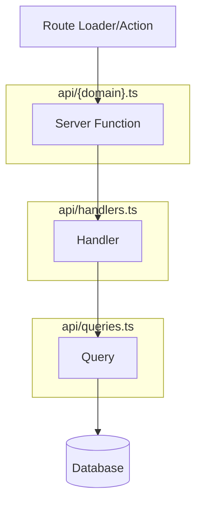

# ADR 002: Domain Architecture

**Status:** Accepted  
**Deciders:** Marciano  
**Date:** 2025-02-14  
**Updated:** 2026-02-21

---

## Context and Problem Statement

We aim to establish a file structure that is future-proof and scalable:

- Low cognitive load
- Clearly separated by architectural layers
- Optimized for developer experience (DX)
- Supports full-stack TanStack Start patterns

---

## Decision Drivers

- Minimize complexity
- Ensure adaptability to future requirements
- Enable clear architectural boundaries
- Support server functions with clean separation of concerns

---

## Decision Outcome

We adopt a combination of **Domain-Driven Design (DDD)** and **Screaming Architecture**.

### Top-Level Structure

```
src/
├── components/     # Global shared React components (layouts, navigation, auth)
├── config/         # Application configuration constants
├── database/       # Drizzle ORM setup, schema, migrations, seeds
├── domains/        # Feature-oriented domain modules (DDD approach)
├── hooks/          # Global custom React hooks
├── lib/            # Pure utility functions (date utils, storage helpers)
├── presentation/   # Presentation mode feature (slides)
├── routes/         # TanStack Router file-based routes
├── styles/         # Global CSS (Tailwind)
├── test/           # Test setup and utilities (mock factories)
├── ui/             # Reusable UI primitives (buttons, skeletons)
└── utils/          # Application utilities (auth, error handling, SEO)
```

### Domain Internal Structure

Each domain follows this structure:

```
src/domains/{domain}/
├── api/
│   ├── {domain}.ts       # Server functions (createServerFn) - entry point
│   ├── handlers.ts       # Business logic handlers (pure functions)
│   ├── handlers.spec.ts  # Handler unit tests
│   ├── queries.ts        # Database operations (Drizzle ORM)
│   └── queries.spec.ts   # Query unit tests
├── components/           # Domain-specific React components
├── data/                 # Static data, constants, fixtures
├── factories/            # Test data factories + seed data factories
├── hooks/                # Domain-specific custom hooks
├── models/               # TypeScript types + DTO conversion functions
├── services/             # Complex business logic, orchestration
│   ├── *.service.ts
│   └── *.service.spec.ts
├── utils/                # Domain-specific utility functions
└── validation/           # Zod schemas for input validation
    ├── schemas.ts
    └── schemas.spec.ts
```

### Positive Consequences

- Code is grouped by business domain, making it easy to find
- Clear separation between server-side and client-side code
- Testable architecture with mocked database queries
- Supports TanStack Start's full-stack patterns

---

## Server Function Flow

The API layer follows a three-tier pattern for clean separation of concerns:



### Layer Responsibilities

| Layer | File | Purpose | Testability |
|-------|------|---------|-------------|
| **Server Function** | `{domain}.ts` | Authentication, authorization, input validation | Integration tests |
| **Handler** | `handlers.ts` | Business logic orchestration, error handling | Unit tests (mock queries) |
| **Query** | `queries.ts` | Database operations with Drizzle ORM | Unit tests (mock db) |

### Example Flow

**1. Server Function** (`api/polls.ts`) - Handles auth and delegates to handler:

```typescript
export const getDailyPoll = createServerFn({ method: "GET" })
  .inputValidator(z.object({ runId: z.number().optional() }))
  .handler(async ({ data }) => {
    const userId = await getAuthenticatedUserId();
    return getDailyPollHandler({ data: { userId, ...data } });
  });
```

**2. Handler** (`api/handlers.ts`) - Contains business logic:

```typescript
export const getDailyPollHandler = async ({
  data,
}: {
  data: { userId: string; runId?: number };
}) => {
  return handleApiOperation(async () => {
    const poll = await getDailyPollWithOptions(data.userId);
    const run = data.runId 
      ? await fetchRunById(data.runId) 
      : await getUserActiveRun(data.userId);
    
    return { poll, run };
  });
};
```

**3. Query** (`api/queries.ts`) - Database operations:

```typescript
export const fetchPollById = async (id: number): Promise<Poll | null> => {
  const pollRecord = await db
    .select()
    .from(pollsTable)
    .where(eq(pollsTable.id, id));

  if (!pollRecord.length) {
    throw new Error("Poll not found");
  }

  return pollFactory.toDTO(pollRecord[0]);
};
```

### Why This Separation?

1. **Server functions** are hard to unit test (require auth mocking)
2. **Handlers** are pure functions - easy to test with mocked queries
3. **Queries** isolate database logic - easy to test with mocked Drizzle
4. Each layer has a single responsibility

---

## File Responsibilities

### Files in Domain Root

| File Pattern | Purpose | When to Use |
|--------------|---------|-------------|
| N/A | DevVoted uses folders, not root-level files | See folder structure below |

### Folder Responsibilities

| Folder | Purpose |
|--------|---------|
| `api/` | Server functions, handlers, and database queries |
| `components/` | React components specific to this domain |
| `data/` | Static configuration, constants, default values |
| `factories/` | Test data factories and database seed factories |
| `hooks/` | Domain-specific React hooks (TanStack Query wrappers) |
| `models/` | TypeScript types + `toDTO`/`fromDTO` conversion functions |
| `services/` | Complex business logic spanning multiple queries |
| `utils/` | Domain-specific helper functions |
| `validation/` | Zod schemas for input validation |

### Naming Conventions

- Components: `{Name}.tsx` (no suffix)
- Hooks: `use{Name}.ts`
- Services: `{name}.service.ts`
- Models: `{name}.ts` in `models/` folder
- Validation: `schemas.ts` in `validation/` folder
- Factories: `{name}.ts` in `factories/` folder

---

## Shared Code

### Cross-Domain Utilities (`src/domains/shared/`)

For utilities used across multiple domains:

```typescript
// src/domains/shared/queryKeys.ts
export const pollQueryKeys = {
  all: ["polls"] as const,
  detail: (pollId: number) => [...pollQueryKeys.all, pollId] as const,
  daily: (userId: string | undefined) => 
    [...pollQueryKeys.all, "daily", userId] as const,
};
```

### Global vs Domain Services

| Location | Use For |
|----------|---------|
| `src/services/` | Infrastructure (logging, caching), truly shared utilities |
| `src/domains/*/services/` | Domain-specific business logic |

---

## UI Component Organization

### `src/ui/` - Pure Presentational Primitives

- No business logic
- Highly reusable across domains
- Examples: `PrimaryButton`, `LoadingSkeleton`, `ErrorComponent`

### `src/components/` - Global Shared Components

- May contain some logic (auth, navigation)
- Used across routes/domains
- Examples: `PageLayout`, `Auth`, `DefaultCatchBoundary`

### `src/domains/*/components/` - Domain Components

- Specific to one domain
- May use domain hooks and services
- Co-located with domain logic

---

## Links

- [Screaming Architecture](https://blog.cleancoder.com/uncle-bob/2011/11/22/screaming-architecture.html)
- [TanStack Start Server Functions](https://tanstack.com/start/latest/docs/framework/react/server-functions)
- [Domain-Driven Design](https://martinfowler.com/bliki/DomainDrivenDesign.html)
